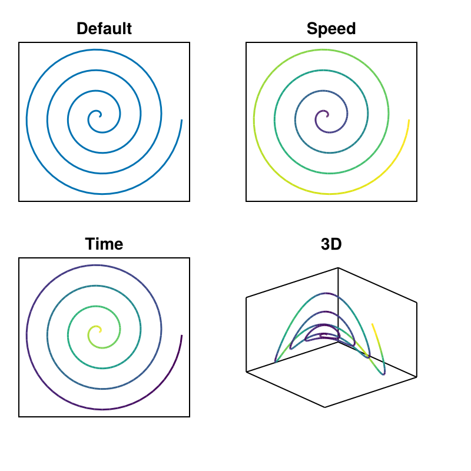
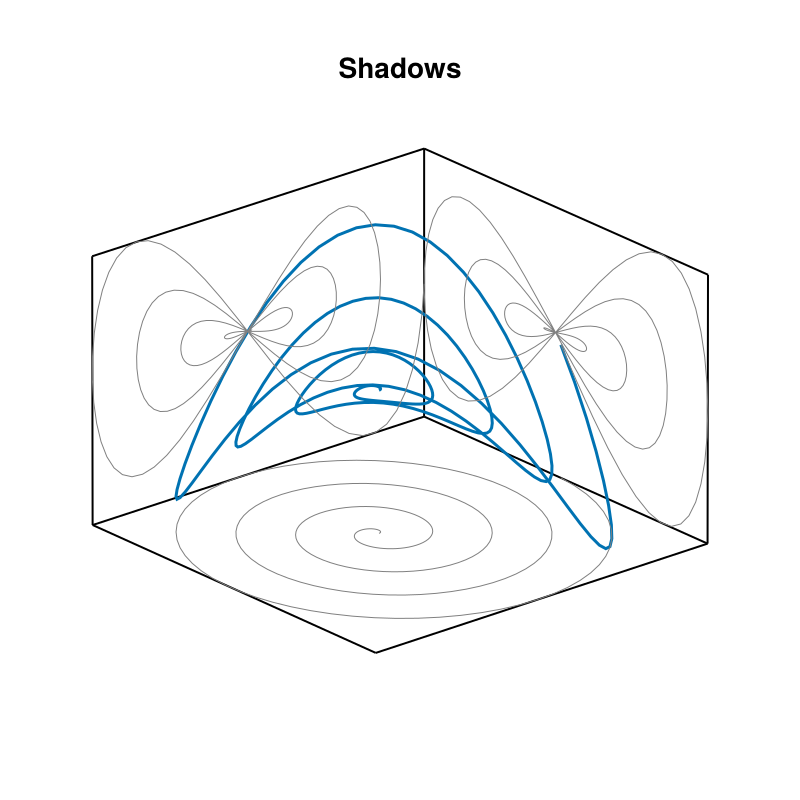
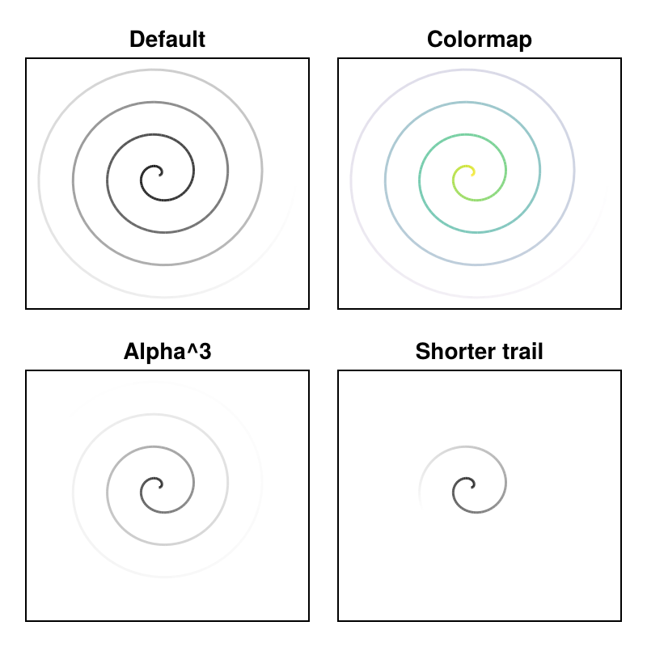
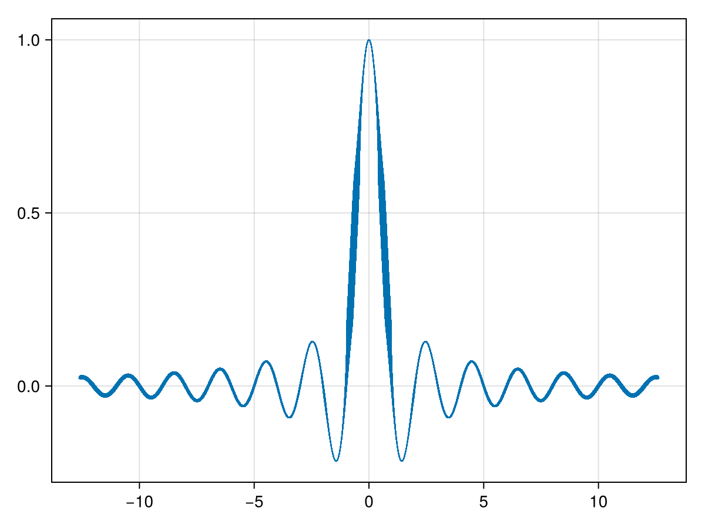

# TimeseriesMakie.jl

Makie recipes for time series. See also: [TimeseriesTools](https://github.com/brendanjohnharris/TimeseriesTools.jl).

## Recipes

Example plots are shown below; see the [documentation](https://brendanjohnharris.github.io/TimeseriesDocs.jl/dev/TimeseriesMakie/) for more details.

### Trajectory

### Shadows

### Trail

### Kinetic

